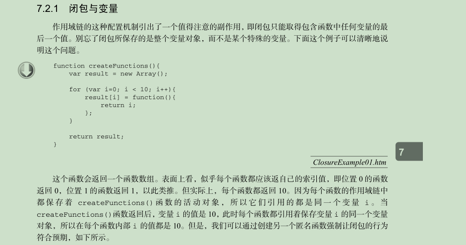
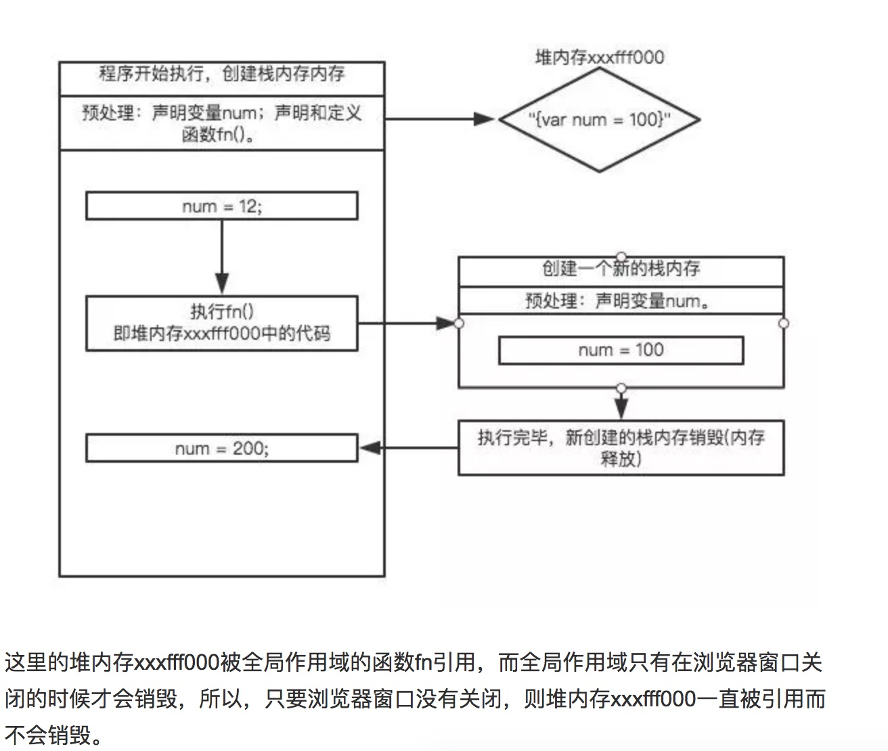

# 6小时jQuery开发小应用
<hr>
1. 作用域与全局变量问题
	
	这里再次碰到了老问题
	
	
	```
	var lis = document.getElementsByTagName("li");
for(var i=0; i<lis.length;i++){
	lis[i].onclick = function(){
	alert(i);
	}
}
	```
	[错误原因 解决方法](https://www.cnblogs.com/junwuyao/p/7674753.html)
	
	代码从上自下，执行完毕后，**li的onclick还没有触发，for循环已经结束！**而for循环没有自己的作用域（js中无块级作用域）！所以循环5次，用的是同一个全局变量i！也就是在for循环转完后，这个全局变量已经变成了5。因此不管点第几个都会是5。
	
	**li的onclick还没有触发，for循环已经结束！** 
	
	这里还涉及JS中的运行机制问题，理解以下几点：
	
	* js是单线程，虽然HTML5提出Web Worker标准，允许JS脚本创建多个线程，但子线程完全受主线程控制，并且不能操作DOM,这个标准并未改变JS是单线程的本质。
	
	* 任务队列，所有任务分为同步任务和异步任务，同步任务是指在主线程上排队执行的任务，异步任务是指进入“任务队列”的任务。在js代码执行的时候，js的代码是按照顺序执行的，从上到下，这个时候是同步的，碰到异步任务就将其放入任务队列中（异步任务包含三种：异步的网络请求，事件绑定和事件监听器，时间触发函数），待主线程空了，就会去读取"任务队列"，这就是JavaScript的运行机制。这个过程会不断重复。


	写个简单的小例子理解下，查看console.log的输出顺序

	```
	//html中加个button
	$(function () {
    var a=10;
    init();
    function init() {
        a = 100;
        console.log("1",a);
    }
    $('#btn').on('click',function () {
    	 a = 200;
        console.log("2",a);
    })
    console.log("3",a);
	});
	```
	
2. [浏览器是如何运行JavaScript代码的？](https://www.jianshu.com/p/c9bbfbf7933f)
	
	```
	var num = 12;
function fn() {
    var num = 100;
}
fn();
num = 200;
	```
	
	
