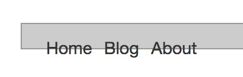
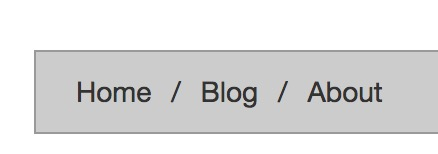
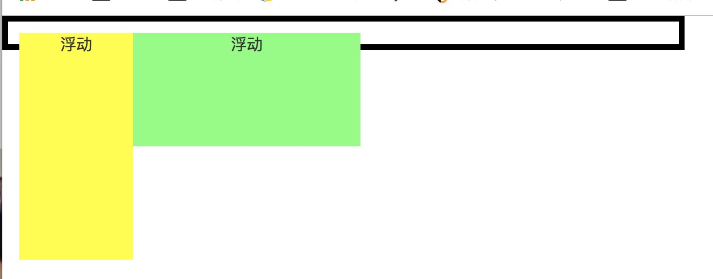
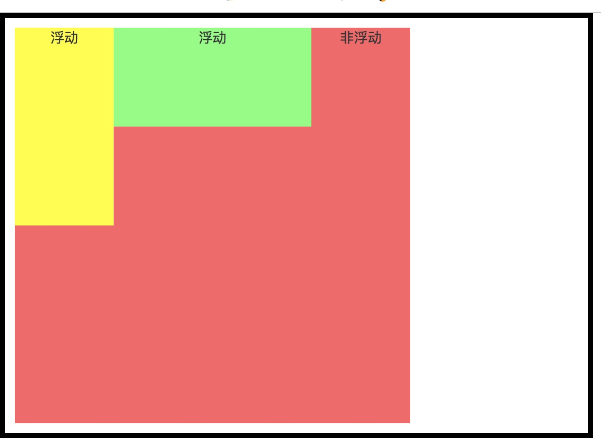
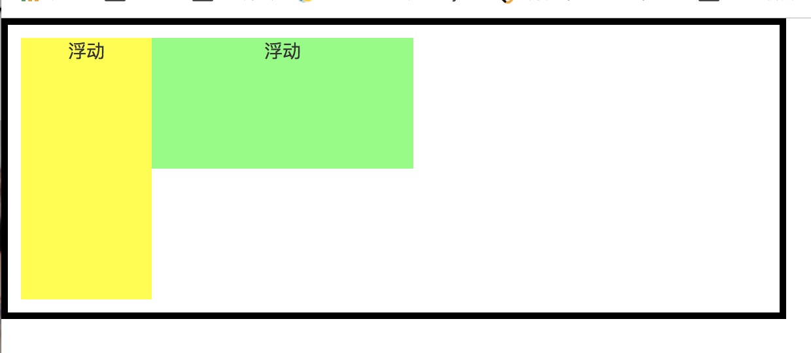

# Bootstrap 第14章 服装品牌网站案例 练习总结
<hr>

### 小常识

1. 设置font-size:100%；即设置字体为默认大小，16px;

2. CSS中几种带有默认边距的标签

	> (1)h1-h6标签，有默认的margin(top,bottom)值，无默认的padding。
	
	>>在chrome中分别为：16,15,14,16,17,19;
	
	> (2)p标签，有默认margin(top,bottom)值,无默认padding值。
	
	>>在Chrome,Firefox,Safari,Opera,Maxthon,IE8.0中：margin:12px 0px; 
	
	>>在IE6.0,7.0中：margin:19px 0px;
	
	> (3)div标签，默认没有内外边距
	
	> (4)ol,ul标签，有默认margin（top,bottom）值，有默认padding-left值
	
	>> 在Chrome,Firefox,Safari,Opera,Maxthon,IE8.0中：margin:12px 0px;padding-left：40px;
	
	>>在IE6.0,7.0中：margin:19px 0px;无默认padding值
	> 网页开发首先清除默认内外边距
body,div,dl,dt,dd,ul,ol,li,h1,h2,h3,h4,h5,h6,
pre,code,form,fieldset,legend,input,textarea,p,
blockquote,th,td,hr,button,article,aside,
details,figcaption,figure,footer,header,hgroup,menu,nav,section {margin:0; padding:0;}

	
3. 设置网页滚动条的颜色： html{scrollbar-base-color: #afb1b5;}

4. CSS3中新增了resize缩放属性，这个属性可以应用到任意元素。目前只有Webkit内核的浏览器才支持这个css3属性，即Google chrome和Apple safari都支持。
	
	而textarea标签中，Webkit内核的浏览器会默认resize的值为both，即用户可以调节元素的宽度和高度，其右下角有一个可以控制缩放的按钮。如果你不愿意让其任意缩放，你可以为textarea添加resize:none，从而去除Webkit内核的浏览器的默认显示。
	
5. 在textarea文本域中设置height/Width是包括边框和内边距的吗？实验是这样，但不明白到底为什么。textarea是行内块级元素。
	
	<font style="color:red">具体是因为box-sizing:border-box;(在bootstrap.css中有设置)，表示为元素指定的任何内边距和边框都将在已设定的宽度和高度内进行绘制。</font>box-sizing:content-box;表示在宽度和高度之外绘制元素的内边距和边框。 
	
6. 滚动条滚动回顶部

	```
	<div class="top"  class="scroll"><a href="#"></a></div>
<script type="text/javascript">
    $(document).ready(function () {
        $(".scroll").click(function () {
            $('html,body').animate({scrollTop: $(this.hash).offset().top}, 1000);
        })
    })
</script>  
	```


###  `<div class="trends">`模块中的问题

1. 右边一排的按钮图标该如何定位？ 四个图标该如何以列表方式排列？

	```
		<figcaption> :设置绝对定位在figure的左上角，w=100%,h=100%
			<h2></h2>
			<p>:设置向右浮动，设置margin
				<a>：若设置“display：block；”则每个a占据一行，即排为一列，否则排为一行
					<i>：i为行内元素，不能直接设置宽高，需要加上“display:block;”或者“display:inline-block;”，否则即便设置了宽高也无法显示
					</i>
				</a>
			</p>
		</figcaption>
	```
	
	**改进**
	可以取消上面的i标签，直接在a标签上设置背景图片，注意，a标签和i标签一样，都是内联元素，而不是内联块级元素，需要设置display：block;才能设置其宽高。
	
	**进一步改进**
	
	```
	<figure> : position:relative;
		<figcaption> 
				<h2></h2>
		</figcaption>
		<p>:设置绝对定位，在figure的右上角，position:absolute;设置margin；
			<a>：a为行内元素，不能直接设置宽高，需要加上“display:block;”或者“display:inline-block;”，否则即便设置了宽高也无法显示
			</a>
		</p>	
	</figure>
	```
		
	

2. 练习时，出现右侧的图标总是被黑色的框覆盖，一直试图用z-index属性，失败，最终发现问题在于 后面的遮盖层中，**::before 伪元素 与 :: after 伪元素**中的内容颠倒所致，未正确理解两种伪元素的区别。

 > (1)实际上，伪元素在CSS1中就已经存在，但是我们现在讨论的:before和:after是在CSS2.1中发布的。起初伪元素的语法是使用一个冒号“:”，但是随着web的发展，在CSS3中伪元素使用两个冒号“::”——也就变成了::before和::after
 
 > (2)使用 ::before 插入的内容在元素中的其他内容之前插入，默认情况下是行内显示。内容的值使用 content 属性指定 ::before 也是一样的，只不过是在内容之后插入。
 
 > (3)::before 和 ::before 是一个不占 DOM 树的内联元素.当我们想指定它们的宽度和高度的时候，我们首先得用display: block把它们声明为块级元素。
 
 > (4)<font style="color:red">另外，使用::after伪元素可以清除浮动，解决高度塌陷的问题，具体原理是什么？为什::before伪元素不能清除浮动？具体理解见下面2.清除浮动的几种方法</font>
 
 >> 举个例子 ：自己动手实践 添加伪元素内容和删除伪元素内容查看两者的效果
 
 >> ```
 	<ul>
    <li>Home</li>
    <li>Blog</li>
    <li>About</li>
</ul>
 ```
 >> ```
   		ul {
            margin: 100px;
            background: #ccc;
            padding: 10px;
            border: 1px solid #999;
            list-style:none;
        }
        /*ul::after {*/
            /*clear: both;*/
            /*content: '';*/
            /*display: block;*/
        /*}*/
        li {
            float: left;
            margin-left: 10px;
        }
        /*li::after {*/
            /*content: '/';*/
            /*margin-left: 10px;*/
        /*}*/
        li:last-child::after{
            content: none;
        }
 ```
 
 >>  
 
 
 
### [**2. 清除浮动的几种方法**](http://www.ruanyifeng.com/blog/2009/04/float_clearing.html)

 > 原始样式： 
   
   ```
   <div class="box">
   		<div class="d1">浮动</div>
    	<div class="d2">浮动</div>
   	</div>	
   ```
   ```
    .box{
            border: 5px solid #000;
            padding: 10px;
            width: 600px;
        }
      .d1{
          float: left;
          background-color: yellow;
          width: 100px;
          height: 200px;
          text-align: center;
      }
      .d2{
          float: left;
          background-color: #73ff76;
          width: 200px;
          height: 100px;
          text-align: center;
      }
   ```
   
 > 原始效果：
 	
 > 
 	
 > **清除浮动方法一，** 在浮动元素下方添加一个非浮动元素。
 >
 >> 原理：父容器现在必须考虑非浮动子元素的位置，而后者肯定出现在浮动元素下方，所以显示出来，父容器就把所有子元素都包括进去了。这种方法比较简单，但是要在页面中增加冗余标签，违背了语义网的原则。
 >
 ```
 	<div class="box">
   		<div class="d1">浮动</div>
    	<div class="d2">浮动</div>
    	<div class="d3">非浮动</div>
	</div>	
 ```
 >
 ```
 .d3{
            background-color: #ff6166;
            width: 400px;
            height: 400px;
            text-align: center;
        }
 ```
 
 > 效果图
 
 >> 
 
 > **清除浮动方法二，** 将父容器也改成浮动定位，这样它就可以带着子元素一起浮动了
 
 >
 ```
 	.box{
            border: 5px solid #000;
            padding: 10px;
            width: 600px;
            float: left;
        }
 ```
 >
 
 > 效果图
 
 >> 
 
 > **清除浮动方法三，** 在.box中添加overflow:hidden;
 
 >> 原理：加上这句话，父元素新建了一个BFC, 而BFC计算高度的时候是包含浮动元素的。 效果同方法二。

 > **清除浮动方法四，** 使用::before伪元素
 >> 原理：方法类似于方法一，可以在父容器的尾部自动创建一个子元素，并且不存在于DOM中，不用像方法一在页面中添加冗余标签。
 
 > 
 ```
 	.box::after{
            content: '';
            display: block;
            width: 400px;
            height: 400px;
            background-color: #c825ff;
        }
 ```
	
 >
 
 > 效果同方法一，注意，IE 6不支持::after伪元素，此时只需在.box父元素中再添加一条语句 “zoom:1;”即可，作用是激活父元素的"hasLayout"属性，让父元素拥有自己的布局。IE使用Layout概念来控制元素的尺寸和位置。如果一个元素有Layout，它就有自身的尺寸和位置；如果没有，它的尺寸和位置由最近的拥有布局的祖先元素控制。
 
 > 这也就能理解为什么 ::after伪元素可以清除浮动但::before伪元素却不行，::after伪元素是在元素A后面添加内容，要想计算A的高度必须把::after伪元素内容计算进去，而::after伪元素内容在浮动元素的后面，因此父元素A把浮动元素也包揽了进去，但是::before伪元素是在A的前面添加内容，即::before伪元素在浮动元素的前面，那么浮动元素依然未被A元素包揽。
 
### z-index在何时起作用？在何时失效？

失效的情况:

* 父标签 position属性为relative；

* 问题标签无position属性（不包括static）；
 
* 问题标签含有浮动(float)属性。
 
* 问题标签的祖先标签的z-index值比较小

解决方法:

* 第一种:  position:relative改为position:absolute；

* 第二种:浮动元素添加position属性（如relative，absolute等）；
 
* 第三种:去除浮动。
 
* 第四种:提高父标签的z-index值  

注意点:

(1):z-index属性只作用在被定位了的元素上。所以如果你在一个没被定位的元素上使用z-index的话，是不会有效果的.

(2)同一个父元素下的元素的层叠效果会受父元素的z-index影响,如果父元素的z-index值很小,那么子元素的z-index值很大也不起作用


[### CSS动画两大组成部分：transition和animation](http://www.runoob.com/css3/css3-animations.html)


###  `<div class="featured-section">`模块中的问题

1. "READ MORE"中的背景颜色随鼠标的移入移出有过渡效果

 > 示例代码
 
 > 
 ```
 <style>
.slickButton {
    color: white;
    font-weight: bold;
    padding: 10px;
    border: solid 1px black;
    background: lightgreen;
    cursor: pointer;
    transition: background 0.5s;
    -webkit-transition: background 0.5s;
}	 
.slickButton:hover {
    color: black;
    background: yellow;
}
</style>
<button class="slickButton">hangge.com</button>
 ```
 
2. 在“READ MORE”中设置“display: inline-block;“与”display: block;” 的区别：
	 
	 > 设置为“display:inline-block;”内容为多少就占多少，设置为“display:block;”占一整行，见背景颜色即可分辨。
	 
3. 为什么read more 会出现问题？？？未解决


### 标题模块中的问题

 > 关于页面的头部的布局问题，困扰了好几天。首先，先设置首页的头部布局，container是bootstrap.css中自带样式设置的，左右内边距为15px，居中。我们根据源代码中的网页显示进行测量计算， 从导航栏右边开始到标题左侧距离为X，Y = X - 15，则container的宽度 = 页面宽度 - 导航栏宽度 - Y * 12。由首页定好container的宽度后， 再可以计算h1的左边距为多少，这样就可以实现明确的定位。